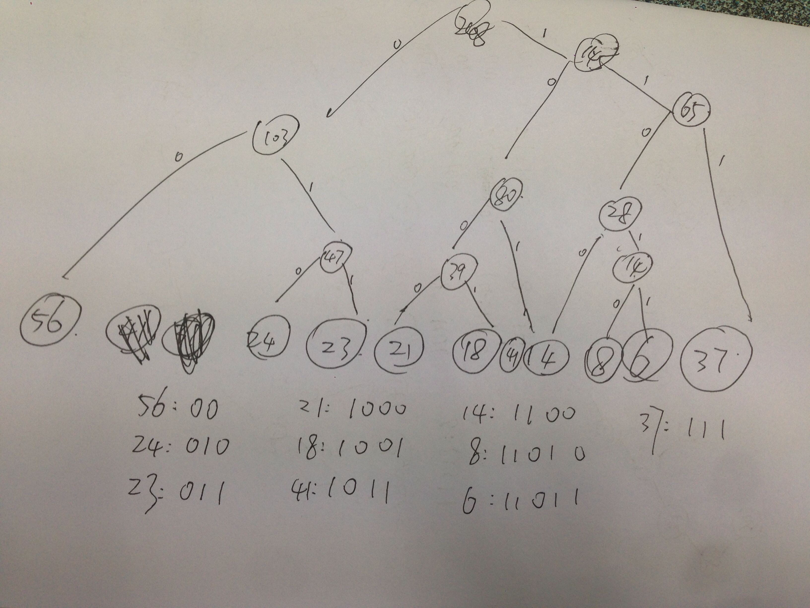
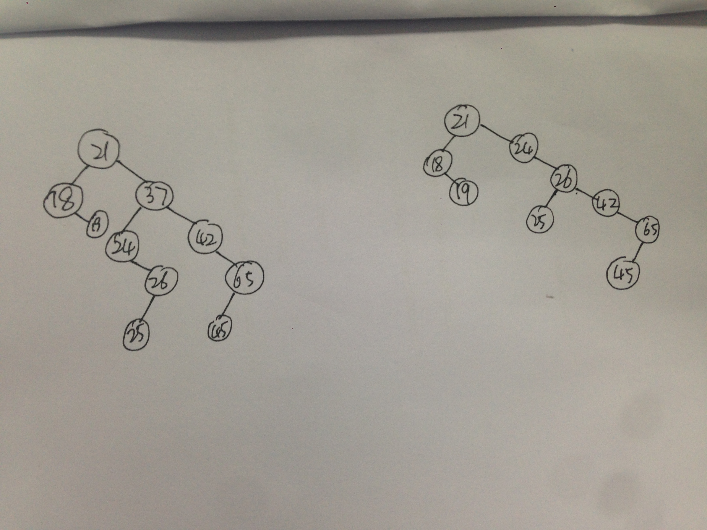

# 数据结构作业

## 数据结构第二章----线性表
- 2-17：
试用顺序存储结构设计一个算法，仅用一个辅助结点，实现将线性表中的结点循环右移K位的运算，并分析算法的时间复杂度。
时间复杂度为：O(Kn)

- 2-21：
设有一个线性表E={e1,e2,...e(n-1),en}，试设计一种算法将线性表逆置，即将元素排列次序颠倒过来，成为逆线性表E’={en,e(n-1),...,e2,e1},要求逆线性表占用原线性表空间，并用顺序和单链表两种方法表示，写出不同的处理结果。

- 2-27：
假设有两个按元素的值递增有序排列的线性表A和B，均以单链表作为存储结构。试编写算法将表A和表B归并为一个按元素的值递减有序（即非递增有序，允许值相同）排列的线性表C，并要求利用原表（即表A和表B）的结点空间存放表C。

## 数据结构第三章----栈和队列
- 3-11：
设单链表中存放着n个字符，试编写算法，判断该字符串是否有中心对称关系，例如xyzzyx,xyzyx都算是中心对称的字符串。要求用尽可能少的时间完成判断。（提示将一半字符先依次进栈）。

- 3-16：
假设以数组sequ[m]存放循环数列的元素，同时设变量rear和quelen分别指示循环队列中元素的位置和内含元素的个数。试给出判断此循环队列的队满条件，并写出相应的入队列和出队列的算法（在出队列的算法中药返回对头元素）。

## 数据结构第四章----串和数组
- 4-19：
若s是一个采用顺序结构存储的串，编写一个函数，要求从s中删除从第i个字符开始的，长度为j的一个子串。

- 4-20：
若x是采用单链表存储的串，编写一个函数将其中的所有字符c替换成字符s。

- 4-26：
已知稀疏矩阵用三元组表示，编写C=A*B的算法。

## 数据结构第五章----树
- 5-14：
假设用于通信的电文由十种不同的符号来组成，这些符号在电文中出现的频率为：8,21,37,24,6,18,23,41,56,14,试为这十个符号设计相应的哈夫曼编码。       

- 5-15：
试对结点序列{21,18,37,42,65,24,19,26,45,25}画出相应的二叉排序树，并且画出删除结点37后的二叉排序树。     

- 5-17：
以二叉链表作存储结构，试编写非递归的先序遍历算法。

- 5-21：
已知二叉树采用二叉链表存储结构，指向根节点存储地址的指针为t。试编写一个算法交换二叉树的所有左右字数的位置，即结点的左子树变成结点的右子树，右子树变为左子树。

## 数据结构第六章----图
